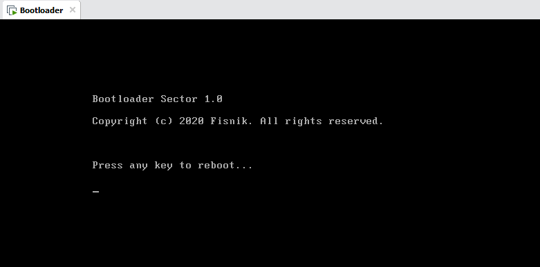

# Bootloader
*Bootloader* is a small program that usually resides in the very first sector and is loaded and executed after the *Basic Input/output System (BIOS)* via a BIOS Interrupt. A bootloader sector is only 512 bytes. The bootloader code resides on **sector 0** in the *Master Boot Record (MBR)*. The BIOS looks for the entry to the bootloader on memory address `0x0000:0x7c00h` using the `INT 19h`. 

This is the standard boot sequence in almost all x86 PCs, and in some PCs the memory address is reversed: `0x7c00:0x0000h`.     

## Build
`nasm -f bin bootloader.asm -o bootloader.img`

## Result
